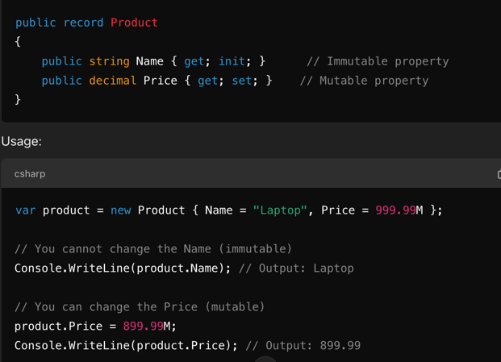

<style>
h1, h2 {
    text-align: center;
}
</style>

# Assignment 03

## Object Oriented Programming

### 1. What are the six combinations of access modifier keywords and what do they do?
>The six combinations of access modifiers are:
> 
> Public, Private, Protected, Internal, Protected Internal and Private Protected
> 
> **Public** :
>   - Makes the class accessible from **anywhere**, even other assemblies!
>   - Used when we want global access.
>   - Example: Utility Functions, APIs etc which need global access
>
> **Private**:
>   - Restricts access to only within the class(not even it's children can access)
>   - Private ensures the data is only visible to the class where its defined, which helps in protecting implentation details from external viewers who don't need to know.
>   - It enforces encapsulation of sensitive data!
>   - Ex: Sensitive logic such as password hashing
>
> **Protected**:
>   - Grants access to the containing class and it's derived classes (**even across assemblies**)
>   - Is used to allow custom inheritance based logic while restricting access.
>   - Design choice here is to allow it to be inherited.
> 
> **Internal**:
>   - Limits access to classes within same assembly (kind of like public but limited to the assembly)
>   - It's usecase is to group functionality within a single project or module without exposing it ot oother assemblies
>   - **internal** is perfect for defining members or types that are shared within a project but should not be accessible from external projects
>     - In the context of .NET, an assembly is a compiled code library used for deployment, versioning, and security. 
>     - Assemblies are the building blocks of .NET applications and can contain classes, interfaces, methods, properties, and other types.
> 
> **Protected Internal**
> - Combination of Protected and INternal, accesible to the class and it's derived classes but within same assembly 
> - Protected internal provides wider access than protected, allowing the member to be accessed by any class in the same assembly as well as derived classes in other assemblies
> 
> **Private Protected**
> - Strictest in context of inheritance.
> - Allows derived classes to access only if they are within the same assembly.
> - This is different that Protected Internal where it allows derived classes to access it across  assemblies while also unique in that it providing it access to other classes in the same assembly
> 
> 
> 
### 2. What is the difference between the static, const, and readonly keywords when applied to a type member?
> **static**
>  - Makes the member part of the type itself rather to any specific instance.
>  - There is only one copy of static memeber that is shared across all instances.
>  - it is modifiable unless explicitly marked as readonly or const.
>  - Static methods can only access static members
>
>  **const**
>  - A const keyword makes the member a compile time constant, that means that it needs to be assigned at declaration.
>  - It can't be modified once declared and compiled.
>  - It implicity is static, i.e. shared by all instances.
>  - compile time constant means it's value can't depend on runtime data.
> 
> **readonly**
> - Needs to be intialized at runtime
> - After initialziation, it becomes immutable.
> - it can only be assigned at declaration or in a constructor
> - Usecase is when we want to make the value immutable but might want different values for different instances.
>

### 3. What does a constructor do?
>  - A  constructor intializes the class memebers .
>  - It is a special class method that can be overloaded.
>  - If a custom implementation isn't given, compile will use a default constructor that will assign default values to members.
>  - it is automatically called when the new keyword is used to create an object.
>  - When the new key word is called, the object is intialized via the constructor.
>    - new keyword is what acually allocates memory. The constructor simply intializes the allocated memory
>  
>

### 4. Why is the partial keyword useful?
> - Partial keyword allows us to split a class, struct or an interface across multiple files but within the same assembly and namespace.
> - The multiple parts are combined at compile time
> - Used in frameworks like Entity Framework whre part of class is generated by tools, helps keep generated lofic seperate from custom logic.
> - Allows for easier collaboration as multiple developers can work on the same class without creating merge conflicts.
>

### 5. What is a tuple?
> - A tuple is a datastructure of fixed number of elements, but it can hold multiple data types.
> - Commonly used to group multiple values and/or returning multiple results from a method.
> - The number of elements in tuple are specific and deciedd at the time of it's creation. new additions or removals aren't possible.
> - Tuples are pure data containers and thus can't include method or custom behavior.
> - can hold both reference and value type data.
>

### 6. What does the C# record keyword do?
> - Used to define an immutable reference type, designed to hold data.
> - Records are seperate from classes because they have Value-Based Equality,
>   - Two records are considered equal if their properties have the same values..classes have reference based equality
> - Properties are implicity immutable, that is once values are defined, can't be changed
>   - But we can make them mutable explicitly by adding get set methods.
> - Example
>   - 
>

### 7. What does overloading and overriding mean?
> - Both Overloading and Overriding are types of polymorphism.
> - They are represent Compile Time and Runtime Polymorphism respectively.
> - Overloading allows methods of the same class to have same names but different number of parameters and implementation.
> - Overriding allows derived classes to override the base class method implementaion for custom logic.
>   - in overriding, the method definiton of both base and derived class need to be same, and base class method needs to be marked as virtual to allow overriding.
>   - The base class method  must be marked  with virtual  or abstract keyword
>   - The derived class must use override keyword
>
>

### 8. What is the difference between a field and a property?
> - Field is a variable declared directky in a class or struct. It represents raw data stored.
> - Property is a member that provides a controlled mechanism to access or modify the value of the field.
>   - get and set are propeties of a field that allows us to modify it.
> - Properties support encapsulation logic while fields by themseleves dont'
> - Fields should be used for internal storage within a class, such as for private or read only
> - Poperties should be used when we want to publicly expose data that needs controlled access.
> - Fields can't have validation logic while propeties can.
    >   - such as, capitalizing the word when setting the name field in a class.
          >     - ``` set => _name = value.ToUpper(); // Adds logic to capitalize name```

### 9. How do you make a method parameter optional?
> - To make a method parameter optional, we can provide a default value to the parameter at the time of function definition.
>   - If caller doesn't provide a value, default value will be used
> - Optional parameters must appear after all required parameters in the method signatur
> - We can have multiple optional parameters, and at time of invocation, we can use named arguments to pick and choose which argument will correspond to which optional parameter.
> - Optional parameters simplify method calls by avoiding unnecessary overloads while providing default behavior.

### 10. What is an interface and how is it different from an abstract class?
>   - An Interface is a design guideline, a contract that defines method signatures for the classes inheriting from it.
>   - Interface only **defines** set of methods, properties, the classes must actually implement them.
>     - Interfaces can't have fields or constructors. All memebrs are implicity public.
>     - IInterfaces support multiple inheritance.
>     
>     
>   - An abstract class on the other hand is a base class that can define both concrete and abstract methods and members.
>   - IT servers as blueprint for derived clases, whcih can override or extend the behavior.
>   - Abstract class allows common functionality to be shared among related classes.
>   - Only supports single inheritance, i.e a class can only inherit from one abstract class.

### 11. What accessibility level are members of an interface?
> - All members of an interface are implicitly public
>
>

### 12. True/False. Polymorphism allows derived classes to provide different implementations of the same method.
> True
>
>

### 13. True/False. The override keyword is used to indicate that a method in a derived class is providing its own implementation of a method.
> True
>
>

### 14. True/False. The new keyword is used to indicate that a method in a derived class is providing its own implementation of a method.
> True
>
>

### 15. True/False. Abstract methods can be used in a normal (non-abstract) class.
> False.
>  - A normal class(non abstract) can't have abstract methods as it has to provide implementation for all it's members.
>  - Abstrac methods can only be declared in abstract class
>
>

### 16. True/False. Normal (non-abstract) methods can be used in an abstract class.
> True.
>
>

### 17. True/False. Derived classes can override methods that were virtual in the base class.
> true.
>
>

### 18. True/False. Derived classes can override methods that were abstract in the base class.
> True.
>
>

### 19. True/False. In a derived class, you can override a method that was neither virtual nor abstract in the base class.
> False
>
>

### 20. True/False. A class that implements an interface does not have to provide an implementation for all of the members of the interface.
> False
>
>

### 21. True/False. A class that implements an interface is allowed to have other members that aren’t defined in the interface.
> True, but it can add it's own members but neeeds to implement the interface ones as well
>
>

### 22. True/False. A class can have more than one base class.
> False.
>
>

### 23. True/False. A class can implement more than one interface.
> True
>
>
## Coding Tasks

### Working with Methods

1. Let’s make a program that uses methods to accomplish a task. Let’s take an array and reverse the contents of it. For example, if you have 1, 2, 3, 4, 5, 6, 7, 8, 9, 10, it would become 10, 9, 8, 7, 6, 5, 4, 3, 2, 1.
   To accomplish this, you’ll create three methods: one to create the array, one to reverse the array, and one to print the array at the end.

Your `Main` method will look something like this:
```csharp
static void Main(string[] args) {
    int[] numbers = GenerateNumbers();
    Reverse(numbers);
    PrintNumbers(numbers);
}
```
The `GenerateNumbers` method should return an array of 10 numbers. (For bonus points, change the method to allow the desired length to be passed in, instead of just always being 10.)

The `PrintNumbers` method should use a `for` or `foreach` loop to print out each item in the array. The `Reverse` method will be the hardest. Give it a try and see what you can make happen. If you get stuck, here’s a couple of hints:

- **Hint #1**: To swap two values, you will need to place the value of one variable in a temporary location to make the swap.
```csharp
// Swapping a and b.
int a = 3;
int b = 5;
int temp = a;
a = b;
b = temp;
```
- **Hint #2**: Getting the right indices to swap can be a challenge. Use a `for` loop, starting at 0 and going up to the `length of the array / 2`. The number you use in the `for` loop will be the index of the first number to swap, and the other one will be the `length of the array minus the index minus 1`. This accounts for the 0-based array indexing.

---

2. The Fibonacci sequence is a sequence of numbers where the first two numbers are 1 and 1, and every other number in the sequence after it is the sum of the two numbers before it. So the third number is 1 + 1, which is 2. The fourth number is the 2nd number plus the 3rd, which is 1 + 2. So the fourth number is 3. The 5th number is the 3rd number plus the 4th number: 2 + 3 = 5. This keeps going forever.
   The first few numbers of the Fibonacci sequence are: 1, 1, 2, 3, 5, 8, 13, 21, 34, 55, ...

Because one number is defined by the numbers before it, this sets up a perfect opportunity for using recursion.

Your mission, should you choose to accept it, is to create a method called `Fibonacci`, which takes in a number and returns that number of the Fibonacci sequence. So if someone calls `Fibonacci(3)`, it would return the 3rd number in the Fibonacci sequence, which is 2. If someone calls `Fibonacci(8)`, it would return 21.

In your `Main` method, write code to loop through the first 10 numbers of the Fibonacci sequence and print them out.

Hints:
- **Hint #1**: Start with your base case. We know that if it is the 1st or 2nd number, the value will be 1.
- **Hint #2**: For every other item, how is it defined in terms of the numbers before it? Can you come up with an equation or formula that calls the `Fibonacci` method again?

---

### Designing and Building Classes Using Object-Oriented Principles

1. Write a program that demonstrates use of four basic principles of object-oriented programming: **Abstraction**, **Encapsulation**, **Inheritance**, and **Polymorphism**.

2. Use **Abstraction** to define different classes for each person type such as `Student` and `Instructor`. These classes should have behavior for that type of person.

3. Use **Encapsulation** to keep many details private in each class.

4. Use **Inheritance** by leveraging the implementation already created in the `Person` class to save code in `Student` and `Instructor` classes.

5. Use **Polymorphism** to create virtual methods that derived classes could override to create specific behavior such as salary calculations.

~~6. Make sure to create appropriate **interfaces** such as `ICourseService`, `IStudentService`, `IInstructorService`, `IDepartmentService`, and `IPersonService`. The `IPersonService` interface should have person-specific methods, while `IStudentService` and `IInstructorService` should inherit from `IPersonService`.~~

#### Person Class
- Calculate the age of the person.
- Calculate the salary of the person using a `decimal` type. Salary cannot be a negative number.
- Allow multiple addresses and include a method to retrieve addresses.

#### Instructor Class
- Belongs to one department and can be the head of the department.
- Instructor will have an added bonus salary based on experience. Calculate years of experience based on the join date.

#### Student Class
- Can enroll in multiple courses.
- Calculate the student’s GPA based on grades for courses. Each course will have grades from A to F.

#### Course Class
- Maintain a list of enrolled students.

#### Department Class
- Have one instructor as the head.
- Maintain a budget for the school year (start and end `DateTime`).
- Offer a list of courses.

---
### 7. Try creating the two classes below, and make a simple program to work with them, as described below:

#### Create a Color class:
- On a computer, colors are typically represented with a red, green, blue, and alpha (transparency) value, usually in the range of 0 to 255. Add these as instance variables.
- A constructor that takes a red, green, blue, and alpha value.
- A constructor that takes just red, green, and blue, while alpha defaults to 255 (opaque).
- Methods to get and set the red, green, blue, and alpha values from a `Color` instance.
- A method to get the grayscale value for the color, which is the average of the red, green, and blue values.

#### Create a Ball class:
- The `Ball` class should have instance variables for size and color (the `Color` class you just created). Let’s also add an instance variable that keeps track of the number of times it has been thrown.
- Create any constructors you feel would be useful.
- Create a `Pop` method, which changes the ball’s size to 0.
- Create a `Throw` method that adds 1 to the throw count, but only if the ball hasn’t been popped (has a size of 0).
- A method that returns the number of times the ball has been thrown.

#### Write some code in your `Main` method to:
- Create a few balls.
- Throw them around a few times.
- Pop a few.
- Try to throw them again, and print out the number of times that the balls have been thrown (popped balls shouldn’t have changed).

### Explore Following Topics

- [Fields](https://learn.microsoft.com/en-us/dotnet/csharp/programming-guide/classes-and-structs/fields)
- [Access Modifiers](https://learn.microsoft.com/en-us/dotnet/csharp/programming-guide/classes-and-structs/access-modifiers)
- [Enumeration Types](https://learn.microsoft.com/en-us/dotnet/csharp/language-reference/builtin-types/enum)
- [Constructors](https://learn.microsoft.com/en-us/dotnet/csharp/programming-guide/classes-and-structs/constructors)
- [Methods](https://learn.microsoft.com/en-us/dotnet/csharp/programming-guide/classes-and-structs/methods)
- [Properties](https://learn.microsoft.com/en-us/dotnet/csharp/programming-guide/classes-and-structs/properties)
- [Inheritance](https://learn.microsoft.com/en-us/dotnet/csharp/fundamentals/tutorials/inheritance)
- [Interfaces](https://learn.microsoft.com/en-us/dotnet/csharp/programming-guide/interfaces/)
- [Polymorphism](https://learn.microsoft.com/en-us/dotnet/csharp/fundamentals/tutorials/oop)
