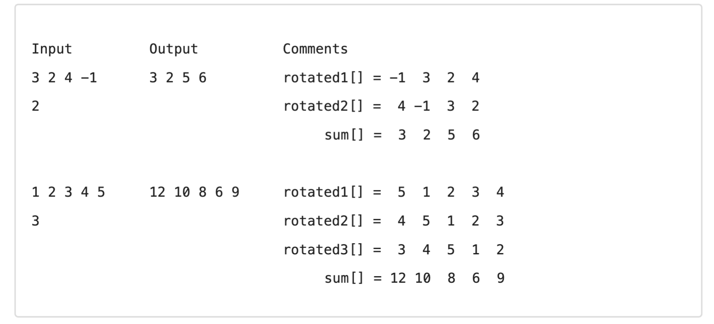

# 02 Arrays and Strings

## Test your Knowledge

1. **When to use String vs. StringBuilder in C#?**
> - Strings are immutable objects in C#, which means a new object is created for each modification, thus slower for frequent modifications. Strings are threadsafe so use them for threadsafe operatons
> 
> - Ex: concatenation or replacing creates new objects in memory
> 
> - StringBuilder is a mutable object, reuses the same object for modifications. Faster for frequent modifications. 
> 
> - SB is not threadsafe by default so some overhead.
> 
    
2. **What is the base class for all arrays in C#?**
> - In C#, all Arrays derive from the base calss SystemArray.
> 
> - System.Array is a abstract class, so can't be instantiated directly.

3. **How do you sort an array in C#?**
> - An array can be sorted via the Array.Sort() method.
>
> - It sorts in Ascending order by default
> 
> - Sort() can also take a custom comparasion logic(via a lambda function) for custom implementation, such as descending sort.
> 
> - Sort is case sensitive for strings.
4. **What property of an array object can be used to get the total number of elements in an array?**
> - Array.Length property can be used.
5. **Can you store multiple data types in System.Array?**
> - No, Arrays in C# are strongly typed and thus have to be intialized with a single datatype.

6. **What’s the difference between the System.Array.CopyTo() and System.Array.Clone()?**
>   **System.Array.CopyTo()**
> 
> - Requires an exisiting array as a target before elements can be copied into. 
> 
> - The target array must have enough space, else it will throw ArgumentException if too small.
> 
> - Old Array can be copied into new Array starting from a specific index. Can be used to merge two arrays.
> 
> - Slower than Clone as element wise copying is involved.
> 
> **System.Array.Clone()** 
> 
> - Creates a shallow copy of the current array and returns it as a new array.
> 
> - Doesn't throw an exception as it always creates a new array of same length.
> 
> - Faster than CopyTo as it directly creates new array.
> 

---

## Practice Arrays

### 1. Copying an Array
Write code to create a copy of an array. First, start by creating an initial array. (You can use whatever type of data you want.) Let’s start with 10 items:
- Declare an array variable and assign it a new array with 10 items in it. Use the things we’ve discussed to put some values in the array.
- Create a second array variable and give it a new array with the same length as the first. Instead of using a number for this length, use the `Length` property to get the size of the original array.
- Use a loop to read values from the original array and place them in the new array.
- Print out the contents of both arrays to ensure everything copied correctly.

### 2. List Management Program
Write a simple program that lets the user manage a list of elements (e.g., a grocery list or "to-do" list). Refer to "Looping Based on a Logical Expression" for implementing an infinite loop. Each time through the loop, ask the user to perform an operation, and then show the current contents of their list.

#### Operations:
- **Add:** `+ some item`
- **Remove:** `- some item`
- **Clear:** `--`

### User Input and List Management Program

Your program should:
1. Read the user's input and determine if it begins with:
   - `+` to add an item.
   - `-` to remove an item.
   - `--` to clear the list.
2. Start each iteration with the following instruction:
   ```csharp
   Console.WriteLine("Enter command (+ item, - item, or -- to clear):");
   
### 3. Find Prime Numbers in a Range

Write a method that calculates all prime numbers in a given range and returns them as an array of integers.

```csharp
static int[] FindPrimesInRange(int startNum, int endNum)
{
    // Implementation
}
```

---

### 4. Rotate and Sum Arrays

Write a program to:

1. Read an array of `n` integers (space-separated on a single line) and an integer `k`.
2. Rotate the array to the right `k` times and sum the arrays after each rotation.

#### Rotation Rule:
After `r` rotations, the element at position `i` moves to `(i + r) % n`.

#### Calculation of `sum[]`:
Use two nested loops:

- Outer loop for rotations: `r = 1 ... k`.
- Inner loop for array indices: `i = 0 ... n-1`.

#### Example:

---

### 5. Longest Sequence of Equal Elements

Write a program to find the longest sequence of equal elements in an array of integers. If multiple sequences of the same length exist, print the **leftmost** one.

#### Example:

| Input                | Output   |
|----------------------|----------|
| `2 1 1 2 3 3 2 2 2`  | `2 2 2`  |
| `1 1 1 2 3 1 3 3`    | `1 1 1`  |

---

### 6. Most Frequent Number

Write a program to find the most frequent number in a sequence. If multiple numbers have the same maximum frequency, print the **leftmost** one.

#### Example:

| Input                           | Output                                      |
|---------------------------------|--------------------------------------------|
| `4 1 1 4 2 3 4 4 1 2 4 9 3`     | `The number 4 is the most frequent (5 times)`|
| `7 7 7 0 2 2 2 0 10 10 10`      | `The number 7 is the most frequent (3 times)`|

---

### Practice Strings

#### 1. Reverse a String

Write a program to reverse a string and print the result. Implement it in **two ways**:

1. Convert the string to a char array, reverse it, then convert it back to a string.
2. Iterate through the string in reverse order using a `for` loop.

#### Example:

| Input       | Output     |
|-------------|------------|
| `sample`    | `elpmas`   |
| `24tvcoi92` | `29iocvt42`|

---

#### 2. Reverse Words in a Sentence

Write a program to reverse the **words** in a sentence without changing the punctuation and spaces.

#### Example:

| Input                                              | Output                                             |
|----------------------------------------------------|---------------------------------------------------|
| `C# is not C++, and PHP is not Delphi!`            | `Delphi not is PHP, and C++ not is C#!`          |
| `The quick brown fox jumps over the lazy dog /Yes! Really!!!/.` | `Really Yes dog lazy the over jumps fox brown /quick! The!!!/.` |

---

#### 3. Extract Palindromes

Write a program to extract all unique palindromes (sorted) from a given text.

#### Example:

| Input                                 | Output           |
|---------------------------------------|------------------|
| `Hi,exe? ABBA! Hog fully a string: ExE. Bob` | `a, ABBA, exe, ExE` |

---

#### 4. Parse a URL

Write a program to parse a URL in the format `[protocol]://[server]/[resource]` and extract its parts:

- `[protocol]` (optional)
- `[server]` (mandatory)
- `[resource]` (optional)

#### Example:

| Input                            | Protocol | Server            | Resource |
|----------------------------------|----------|-------------------|----------|
| `https://www.apple.com/iphone`   | `https`  | `www.apple.com`   | `iphone` |
| `ftp://www.example.com/employee` | `ftp`    | `www.example.com` | `employee`|
| `www.apple.com`                  | `""`    | `www.apple.com`   | `""`     |
